#  QuickLLaMA: Query-aware Inference Acceleration for Large Language Models

## Overview
We introduce Query-aware Inference for LLMs (Q-LLM), a system designed to process extensive sequences akin to human cognition. By focusing on memory data relevant to a given query, Q-LLM can accurately capture pertinent information within a fixed window size and provide precise answers to queries. It doesn't require extra training and can be seamlessly integrated with any LLMs. Q-LLM using LLaMA3 (QuickLLaMA) can read Harry Potter within 30s and accurately answer the questions. Q-LLM improved by 7.17% compared to the current state-of-the-art on LLaMA3, and by 3.26% on Mistral on the $\infty$-bench. In the Needle-in-a-Haystack task, On widely recognized benchmarks, Q-LLM improved upon the current SOTA by 7.0% on Mistral and achieves 100% on LLaMA3. 

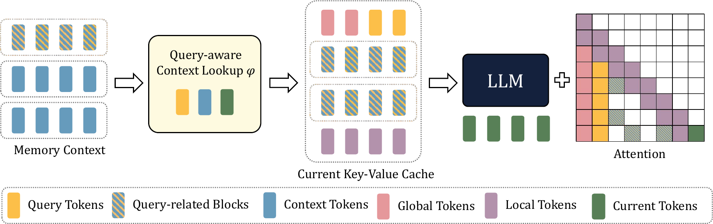

## Examples
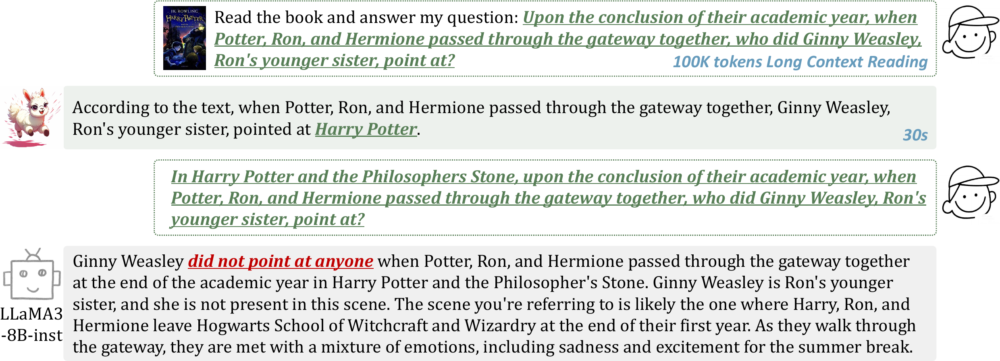 
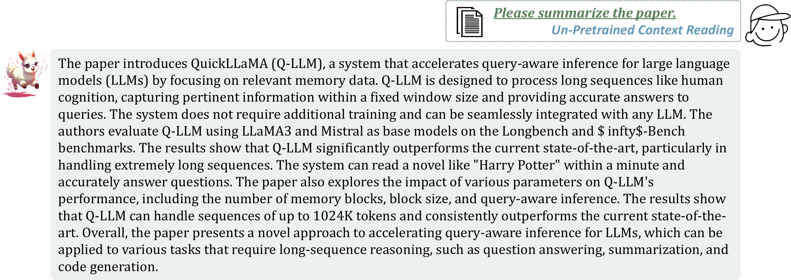
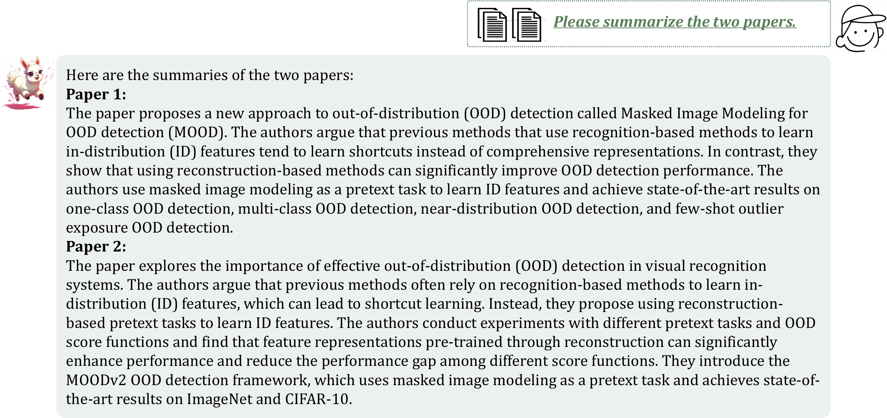 
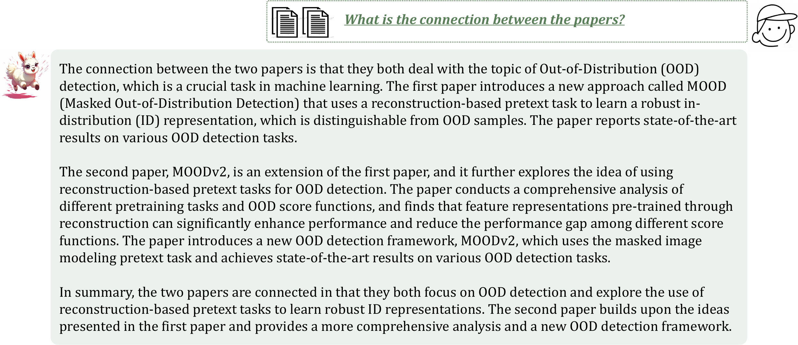 
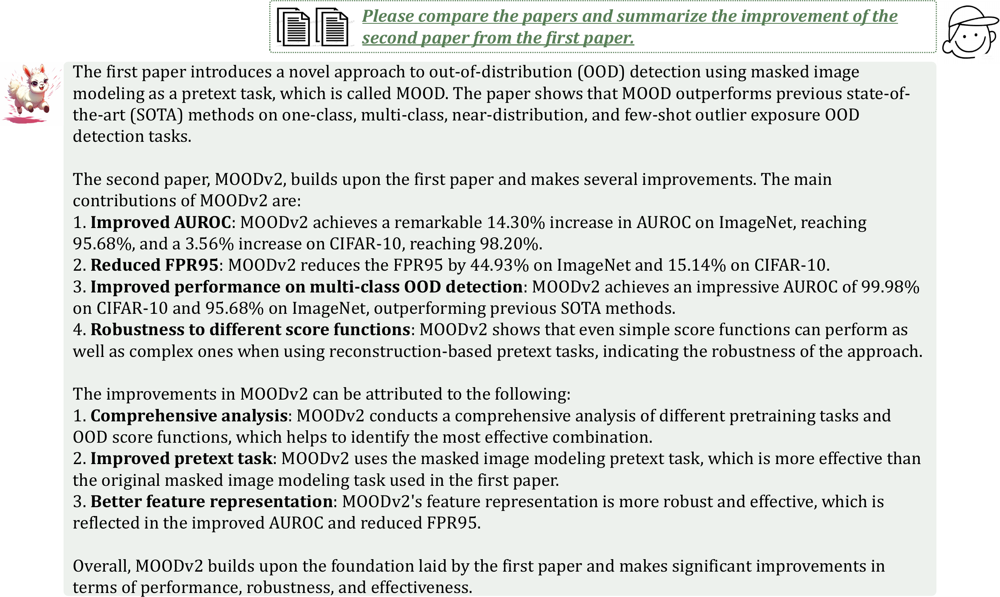 
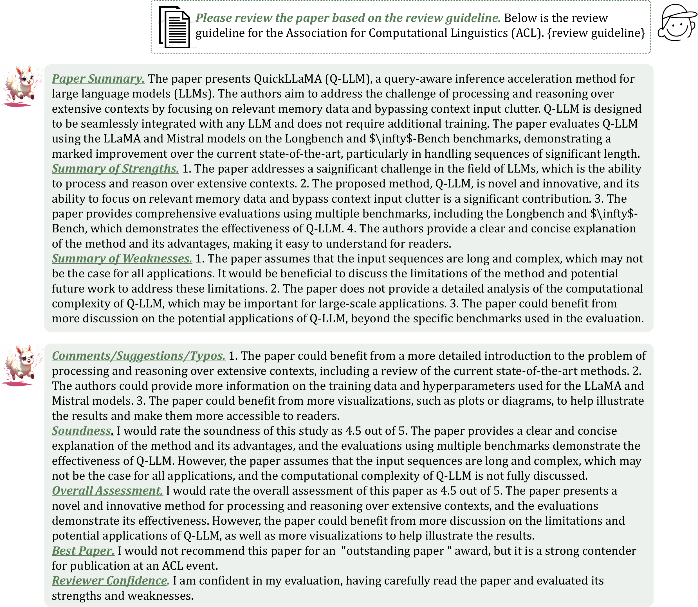 
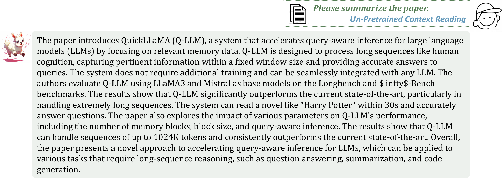 
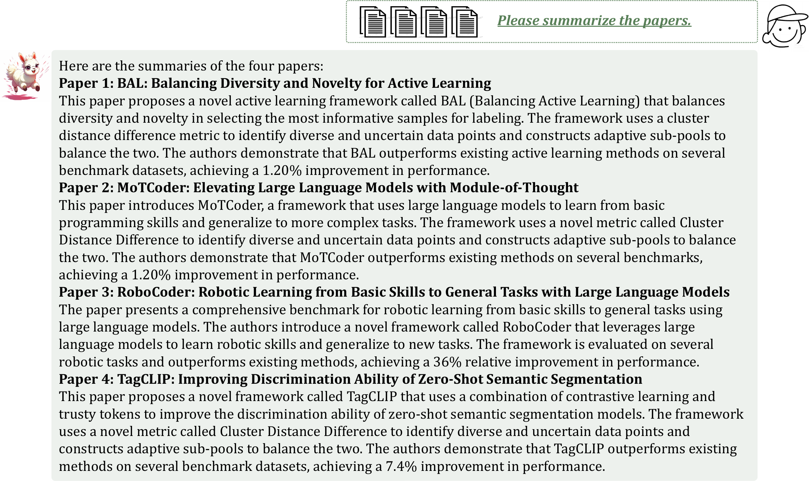 
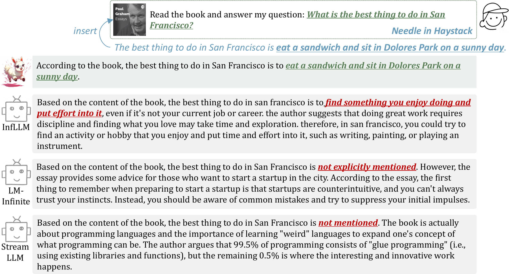 
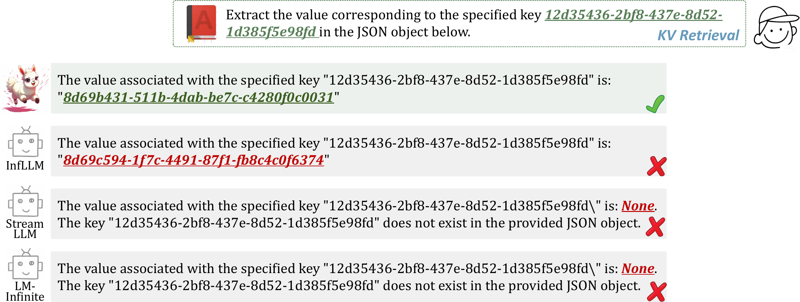 
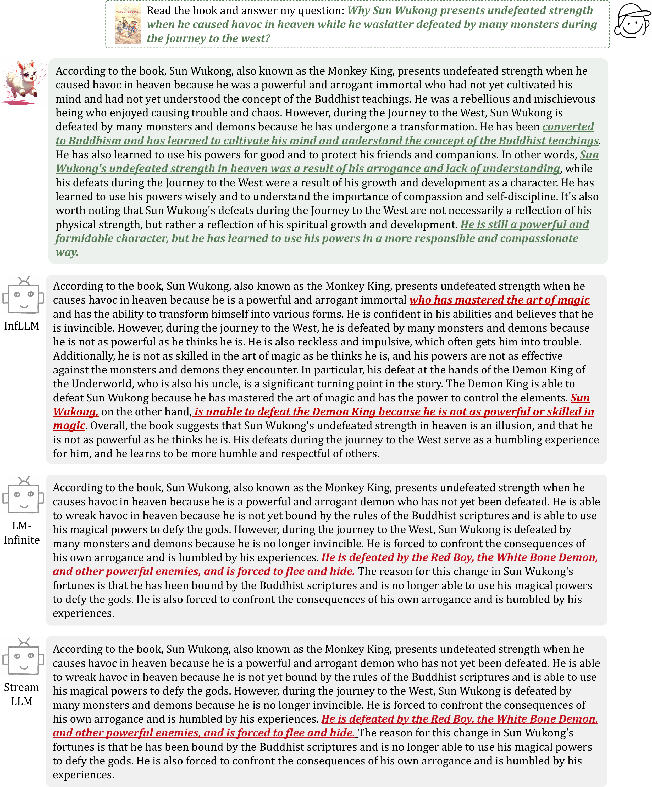 

## Usage
The code will be released soon.